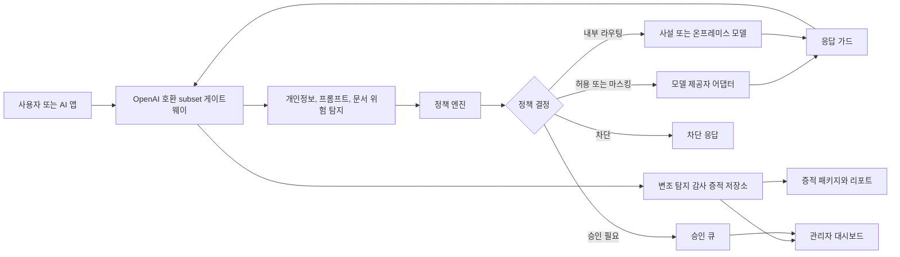
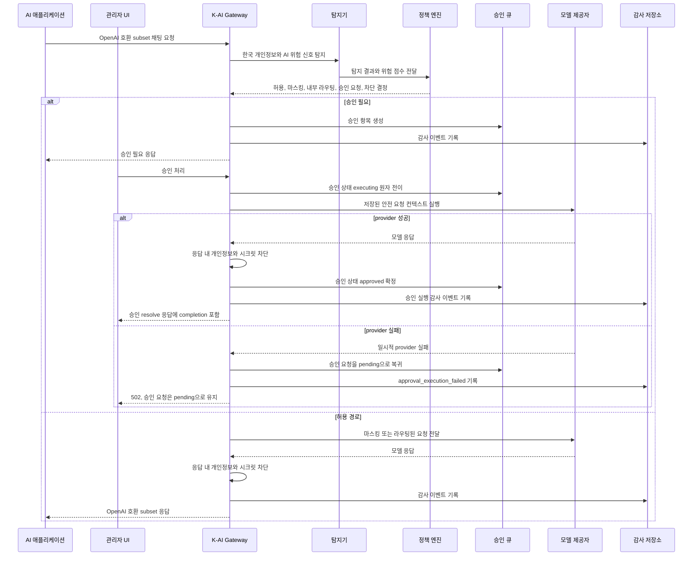

# K-AI Security Gateway

[English](README.md) | [한국어](README.ko.md)

K-AI Security Gateway는 조직이 LLM과 AI 에이전트를 안전하게 쓰기 위해 필요한
AI 사용 통제, 개인정보 마스킹, 정책 집행, 승인, 감사 증적을 한 지점에서 처리하는
한국어 우선 보안 게이트웨이입니다.

현재 상태는 로컬 MVP 릴리스 후보입니다. 내부 검토, PoC, 아키텍처 검증, 보안 통제
흐름 검증에 적합하지만, 아직 인증된 운영용 컴플라이언스 제품은 아닙니다.

## 왜 필요한가

기업과 기관은 AI를 단순히 막고 싶어 하는 것이 아닙니다. 실제로는 다음 질문에 답할
수 있어야 합니다.

- 누가 어떤 데이터를 어떤 AI 모델로 보냈는가?
- 개인정보와 영업비밀이 외부 LLM으로 나가기 전에 탐지되었는가?
- 고위험 요청은 차단, 내부 모델 라우팅, 마스킹, 승인 요청 중 무엇으로 처리되었는가?
- 나중에 감사나 사고조사 때 근거를 재구성할 수 있는가?
- AI 에이전트가 도구를 호출하거나 데이터를 이동할 때 사람의 승인 지점이 있는가?

이 프로젝트는 이런 문제를 "AI 백신"처럼 사후 탐지만 하는 방식이 아니라,
AI 사용 경로의 앞단에서 정책과 증적을 남기는 방식으로 풀기 위해 시작되었습니다.

## 핵심 기능

- OpenAI 호환 subset `/v1/chat/completions` 게이트웨이
- 외부, 사설, 국내 SaaS, 온프레미스 모델 구역 라우팅
- 한국 개인정보 탐지와 마스킹
- 프롬프트 인젝션, 데이터 반출, 문서/RAG 위험 탐지
- 정책 엔진: `allow`, `mask`, `route_private`, `require_approval`, `block`
- 서버 측 관리자/승인자 토큰 레지스트리
- 사람 승인 큐
- 변조 탐지 가능한 감사 이벤트 체인
- SQLite 기반 로컬 증적 저장소
- 요청 단위 증적 패키지 생성
- 정책 리포트와 개인정보 리포트 초안
- 모델 응답의 개인정보/시크릿 차단 가드
- `/admin` 정적 관리자 대시보드
- 감사 이벤트 검색과 CSV/JSONL 내보내기
- Docker Compose와 PowerShell 로컬 실행 스크립트

## 전체 구조



## 처리 흐름



## 저장소 구성

```text
apps/gateway_api/          FastAPI 앱과 정적 관리자 대시보드
src/kai_security/          게이트웨이, 정책, 탐지기, 증적, 리포트 핵심 코드
policies/default.yaml      기본 정책 세트
docs/                      정책, 이벤트, 배포, 위협 모델, MVP 문서
scripts/run-dev.ps1        로컬 PowerShell 서버 실행기
scripts/smoke-test.ps1     엔드투엔드 smoke 테스트
tests/                     단위 테스트와 API 계약 테스트
```

## 빠른 시작

필요한 도구:

- Python 3.11 이상
- Windows PowerShell
- 선택 사항: Docker Desktop

가상환경을 만들고 의존성을 설치합니다.

```powershell
python -m venv .venv
.\.venv\Scripts\Activate.ps1
python -m pip install --upgrade pip
python -m pip install fastapi uvicorn pytest
```

client, 관리자, 승인자 토큰을 설정합니다. 실제 운영 토큰은 절대 Git에 커밋하지 마세요.

```powershell
$env:KAI_SECURITY_CLIENT_TOKENS = "client-token=client-1:security"
$env:KAI_SECURITY_APPROVER_TOKENS = "approver-token=manager-1:security_manager"
$env:KAI_SECURITY_ADMIN_TOKENS = "admin-token=manager-1:security_manager"
$env:KAI_SECURITY_DB_PATH = ".\data\evidence.sqlite3"
```

서버를 실행합니다.

```powershell
./scripts/run-dev.ps1 -Port 8765
```

관리자 대시보드를 엽니다.

```text
http://127.0.0.1:8765/admin
```

대시보드는 입력한 관리자 토큰을 `Authorization: Bearer ...` 헤더로만 사용합니다.
MVP 테스트 환경에는 실제 고객 데이터나 실제 비밀키를 넣지 마세요.

## Docker Compose 실행

`.env.example`을 참고해 `.env`를 만들고 placeholder 토큰을 교체한 뒤 실행합니다.

```powershell
docker compose up --build
```

접속 주소:

```text
http://127.0.0.1:8765
```

Docker Compose는 `kai-security-data` 볼륨에 감사 증적 DB를 저장합니다.

## 모델 제공자 설정

엔드포인트를 설정하지 않으면 로컬 echo 제공자를 사용합니다. 현재 OpenAI 호환 범위는
안전 우선 subset입니다. 요청은 user-visible 메시지 중심으로 재구성되고,
`temperature`, `max_tokens`, `top_p`, `response_format`만 allowlist로 전달됩니다.
스트리밍과 tool calling passthrough는 이 MVP에서 지원하지 않습니다.

```powershell
$env:KAI_SECURITY_EXTERNAL_OPENAI_COMPATIBLE_ENDPOINT = "https://api.openai.com"
$env:KAI_SECURITY_EXTERNAL_OPENAI_COMPATIBLE_API_KEY = "replace-with-real-key-outside-git"

$env:KAI_SECURITY_PRIVATE_LLM_ENDPOINT = "http://10.0.0.10:8080"
$env:KAI_SECURITY_DOMESTIC_SAAS_ENDPOINT = "https://domestic-saas.internal"
$env:KAI_SECURITY_ON_PREM_LLM_ENDPOINT = "http://onprem.internal:8080"
```

지원 제공자 이름:

- `external-openai-compatible`
- `private-llm`
- `domestic-saas`
- `on-prem-llm`

Gateway 내부 메타데이터는 기본적으로 upstream provider에 보내지 않습니다. 최소 필드
(`request_id`, `action`, `policy_id`)만 `X-KAI-Security` 헤더로 보내려면 명시적으로 켭니다.

```powershell
$env:KAI_SECURITY_SEND_UPSTREAM_METADATA = "true"
```

## 정책 로딩

정책 파일을 지정하려면 `KAI_SECURITY_POLICY_PATH`를 사용합니다.

```powershell
$env:KAI_SECURITY_POLICY_PATH = "policies/default.yaml"
```

값이 없거나 파일이 없으면 기본 정책을 사용합니다. 지정한 정책 파일이 존재하지만 파싱이나
검증에 실패하면 시작에 실패합니다. 정책 오류가 조용히 무시되지 않도록 하기 위한 선택입니다.

주요 엔드포인트:

- `GET /v1/policies`
- `POST /v1/policies/simulate`
- `GET /v1/audit/events`
- `GET /v1/audit/events/export?format=csv|jsonl`
- `GET /v1/reports/policy`
- `GET /v1/reports/evidence-package/{request_id}`

## 검증

저장소 루트에서 실행합니다.

```powershell
$env:PYTHONPATH='src'
python -m unittest discover -s tests
python -m compileall src apps
node --check apps\gateway_api\static\admin.js
docker compose --env-file .env.example config --quiet
```

서버가 떠 있는 상태에서는 다음 smoke 테스트를 실행합니다.

```powershell
./scripts/smoke-test.ps1 `
  -BaseUrl "http://127.0.0.1:8765" `
  -AdminToken "admin-token-1" `
  -ClientToken "client-token-1"
```

Smoke 테스트는 마스킹, 정책 시뮬레이션, 증적 패키지, 감사 이벤트 검색,
CSV/JSONL 내보내기에서 원문 개인정보가 새지 않는지 확인합니다.

## 공개 배포 시 보안 주의

- 실제 제공자 키, 관리자 토큰, 승인자 토큰, 감사 DB, 원문 프롬프트, 고객 데이터는 커밋하지 마세요.
- `/v1/chat/completions`와 `/v1/security/evaluate` 호출에는 `KAI_SECURITY_CLIENT_TOKENS`
  기반 client Bearer token이 필요합니다.
- `.env`, `.env.*`, `data/`, SQLite 파일, 로그, 생성 산출물, worktree는 기본적으로 무시됩니다.
- `.env.example`에는 placeholder만 들어 있습니다.
- 현재 토큰 기반 관리자/승인자 흐름은 MVP용입니다. 운영 배포 전에는 SSO/OIDC, 네트워크 통제,
  TLS, 키 로테이션, 보존 정책, 역할 기반 권한을 별도로 붙여야 합니다.
- 관리자 대시보드는 관리자/승인자 토큰을 페이지 메모리에만 보관합니다. 새로고침하면 토큰은 지워집니다.
- 승인된 모델 응답은 승인 resolve 응답과 관리자 UI에 표시됩니다. 최초 채팅 클라이언트로 callback 전달은
  아직 MVP 범위에 포함하지 않았습니다.
- 승인 후 provider 실행은 임시 `executing` 상태와 idempotency key를 사용하므로 중복 승인 요청이
  중복 모델 응답을 만들지 않습니다.
- 승인 후 provider 실행이 실패하면 승인 요청은 `pending`으로 돌아가 재시도할 수 있습니다. 실패 증적에는
  sanitize된 오류 유형, provider 상태 코드, 시도 횟수, provider 오류 본문 hash, 상태 코드 기반 재시도
  가능 여부가 남습니다.
- provider 원문 오류 본문은 exception message, API 응답, 증적 패키지 timeline에 넣지 않습니다. 필요할 때만
  SHA-256 hash로 상관관계를 확인할 수 있게 남깁니다.
- 관리자는 `POST /v1/approvals/recover-stale`로 오래된 in-memory `executing` 승인 요청을 `pending`으로
  되돌릴 수 있습니다. 복구 내역은 `approval_execution_stale_recovered` 이벤트로 기록됩니다.
- Docker Compose는 기본적으로 API를 `127.0.0.1:8765`에만 바인딩합니다. 외부 노출 전에는 reverse proxy,
  TLS, 네트워크 allowlist를 붙여야 합니다.
- 증적 리포트는 검토 보조 자료입니다. 법률 자문이나 공식 감사 인증을 대체하지 않습니다.

보안 신고와 취급 기준은 [SECURITY.md](SECURITY.md)를 참고하세요.

## 현재 MVP 한계

- 스트리밍 채팅 응답과 tool calling pass-through는 아직 없습니다.
- 운영용 SSO/RBAC 통합은 아직 없습니다.
- 승인된 completion을 최초 클라이언트로 callback 또는 polling 전달하는 기능은 아직 없습니다.
- 승인 실행 안전성은 현재 단일 프로세스 in-memory MVP 기준입니다. multi-worker, multi-replica 운영 배포에는
  SQLite/Postgres 같은 트랜잭션 기반 영속 승인 저장소와 compare-and-set 상태 전이가 필요합니다.
- provider idempotency key는 현재 attempt 단위입니다. 후속 영속 실행 ledger에서는 논리적 approval idempotency와
  attempt 단위 감사 증적을 분리해야 합니다.
- 대용량 감사 로그 내보내기는 커서 기반 페이지네이션이 필요합니다.
- 대시보드에서 정책 편집과 버전 게시까지는 완료되지 않았습니다.
- 원문 프롬프트 암호화 보관소 분리와 보존 정책 집행은 후속 하드닝 항목입니다.
- 개인정보 탐지는 한국어 우선 rule 기반입니다. 운영 전 조직별 패턴을 추가해야 합니다.

## 로드맵

1. Gateway 하드닝: 스트리밍, provider retry budget, 운영 인증, rate limit, quota, 보존 정책, 암호화 증적 분리
2. Agent Firewall / Tool Broker: 도구 허용목록, 최소권한, 임시 권한, 고위험 도구 호출 승인
3. AI SOC Agent: 사고 타임라인, 경보 설명, MITRE ATT&CK/ATLAS 매핑, 대응 플레이북 초안
4. AI Compliance Agent: AI 기본법, 개인정보보호, ISMS-P, CSAP, N2SF 스타일 통제 증적과 리포트 초안
5. 공급망 하드닝: lockfile, pip-audit, 이미지 스캔, SBOM, 릴리스 산출물 검증

## 문서

- [MVP 릴리스 후보 상태](docs/mvp-release-candidate.md)
- [배포 안내](docs/deployment.md)
- [정책 명세](docs/policy-spec.md)
- [이벤트 스키마](docs/event-schema.md)
- [위협 모델](docs/threat-model.md)
- [SQLite 증적 저장소](docs/sqlite-store.md)
- [개발 마스터플랜](K-AI-Security-Gateway-Development-Plan.md)

## 라이선스

아직 오픈소스 라이선스를 추가하지 않았습니다. 라이선스를 명시하기 전까지는 기본 저작권
규칙이 적용됩니다. 외부 재사용이나 기여를 받으려면 먼저 라이선스를 선택하세요.
