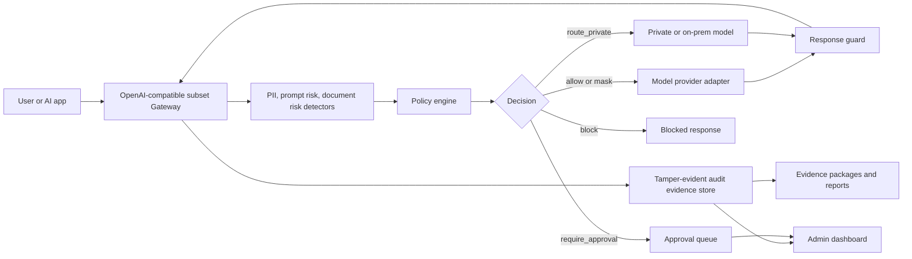
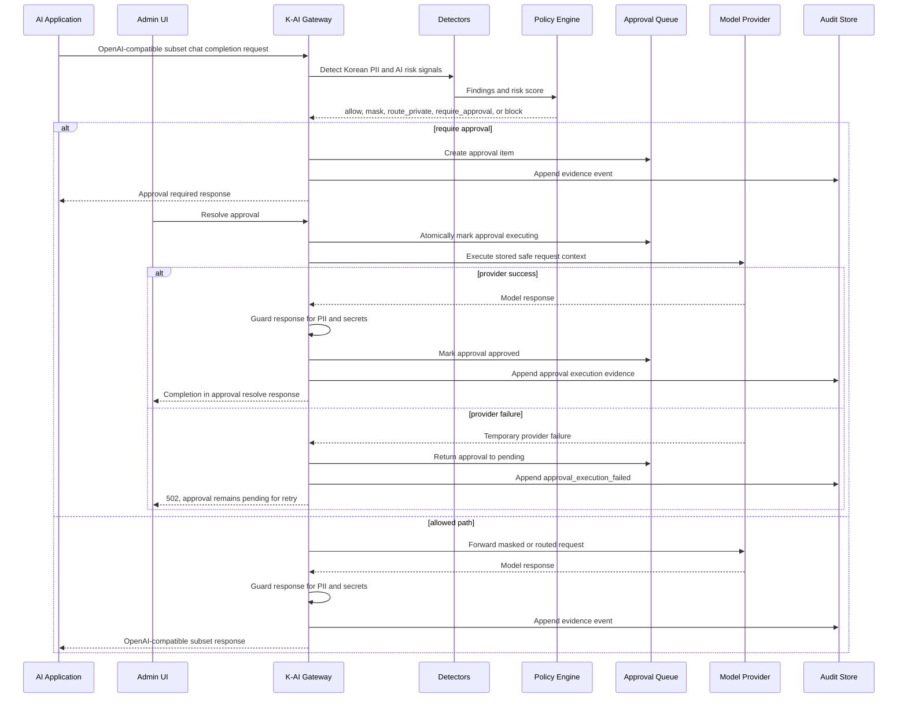

# K-AI Security Gateway

[English](README.md) | [한국어](README.ko.md)

K-AI Security Gateway is a Korean-first AI usage control, privacy filtering, policy
enforcement, approval, and audit evidence gateway for organizations that want to use
LLM services without losing control of sensitive data.

It is designed as a local MVP and proof-of-concept for teams that need a practical
control point between users, AI applications, internal tools, and model providers.

> Status: MVP release candidate. This repository is suitable for local evaluation,
> architecture review, and internal proof-of-concept work. It is not yet a certified
> production compliance product.

## Why This Exists

Companies do not only need an "AI blocker." They need a way to let people use AI
while keeping sensitive records, personal data, approval duties, and audit trails
visible.

K-AI Security Gateway starts from that position:

- AI usage should be observable before it becomes enforceable.
- Sensitive Korean business data needs local language-aware detection.
- High-risk AI requests should be routed, masked, approved, or blocked by policy.
- Security and compliance teams need evidence packages, not only raw logs.
- Human approval must remain explicit for actions with legal, privacy, or business risk.

## Core Features

- OpenAI-compatible subset `/v1/chat/completions` gateway
- Provider routing for external, private, domestic SaaS, and on-prem model zones
- Korean PII detection and masking
- Prompt-injection, data-exfiltration, and document/RAG risk detection
- Policy engine with `allow`, `mask`, `route_private`, `require_approval`, and `block`
- Server-side admin and approver token registry
- Human approval queue
- Tamper-evident audit event chain
- SQLite-backed evidence store for local persistence
- Request-level evidence package generation
- Policy report and privacy report drafts
- Model response guard for PII masking and secret blocking
- Static admin dashboard at `/admin`
- Audit event search and CSV/JSONL export
- Docker Compose and PowerShell local run scripts

## Architecture



## Decision Flow



## Repository Layout

```text
apps/gateway_api/          FastAPI app and static admin dashboard
src/kai_security/          Core gateway, policy, detectors, evidence, reports
policies/default.yaml      Default policy set
docs/                      Policy, event, deployment, threat-model, MVP notes
scripts/run-dev.ps1        Local PowerShell server launcher
scripts/smoke-test.ps1     End-to-end smoke check script
tests/                     Unit and API contract tests
```

## Quick Start

Requirements:

- Python 3.11 or newer
- PowerShell on Windows for the helper scripts
- Optional: Docker Desktop for Compose-based evaluation

Create a virtual environment and install API dependencies:

```powershell
python -m venv .venv
.\.venv\Scripts\Activate.ps1
python -m pip install --upgrade pip
python -m pip install fastapi uvicorn pytest
```

Set local client, admin, and approver tokens:

```powershell
$env:KAI_SECURITY_CLIENT_TOKENS = "client-token=client-1:security"
$env:KAI_SECURITY_APPROVER_TOKENS = "approver-token=manager-1:security_manager"
$env:KAI_SECURITY_ADMIN_TOKENS = "admin-token=manager-1:security_manager"
$env:KAI_SECURITY_DB_PATH = ".\data\evidence.sqlite3"
```

Run the local server:

```powershell
./scripts/run-dev.ps1 -Port 8765
```

Open the admin dashboard:

```text
http://127.0.0.1:8765/admin
```

The dashboard uses the admin token as an `Authorization: Bearer ...` header. Do not
put real secrets or production personal data into an MVP test environment.

## Docker Compose

Copy `.env.example` to `.env`, replace the placeholder tokens, then run:

```powershell
docker compose up --build
```

The API is exposed on:

```text
http://127.0.0.1:8765
```

Docker Compose stores audit evidence in the `kai-security-data` volume.

## Provider Configuration

The gateway uses a local echo provider unless an endpoint is configured. The current
OpenAI-compatible surface is a safety-first subset: requests are rebuilt from
user-visible messages, `temperature`, `max_tokens`, `top_p`, and `response_format`
are forwarded when present, and streaming/tool calling passthrough is not supported
in this MVP.

```powershell
$env:KAI_SECURITY_EXTERNAL_OPENAI_COMPATIBLE_ENDPOINT = "https://api.openai.com"
$env:KAI_SECURITY_EXTERNAL_OPENAI_COMPATIBLE_API_KEY = "replace-with-real-key-outside-git"

$env:KAI_SECURITY_PRIVATE_LLM_ENDPOINT = "http://10.0.0.10:8080"
$env:KAI_SECURITY_DOMESTIC_SAAS_ENDPOINT = "https://domestic-saas.internal"
$env:KAI_SECURITY_ON_PREM_LLM_ENDPOINT = "http://onprem.internal:8080"
```

Supported provider names:

- `external-openai-compatible`
- `private-llm`
- `domestic-saas`
- `on-prem-llm`

If endpoint variables are absent, providers keep using the mock/echo behavior.

Gateway metadata is not sent to upstream providers by default. To opt in to a minimal
`X-KAI-Security` header containing only `request_id`, `action`, and `policy_id`, set:

```powershell
$env:KAI_SECURITY_SEND_UPSTREAM_METADATA = "true"
```

## Policy Loading

Set `KAI_SECURITY_POLICY_PATH` to a JSON-compatible YAML/JSON policy file:

```powershell
$env:KAI_SECURITY_POLICY_PATH = "policies/default.yaml"
```

If the variable is unset or the file is missing, the built-in default policy set is
used. If the configured file exists but cannot be parsed or validated, startup fails
so policy mistakes are not hidden.

Useful endpoints:

- `GET /v1/policies`
- `POST /v1/policies/simulate`
- `GET /v1/audit/events`
- `GET /v1/audit/events/export?format=csv|jsonl`
- `GET /v1/reports/policy`
- `GET /v1/reports/evidence-package/{request_id}`

## Verification

Run from the repository root:

```powershell
$env:PYTHONPATH='src'
python -m unittest discover -s tests
python -m compileall src apps
node --check apps\gateway_api\static\admin.js
docker compose --env-file .env.example config --quiet
```

With a server running:

```powershell
./scripts/smoke-test.ps1 `
  -BaseUrl "http://127.0.0.1:8765" `
  -AdminToken "admin-token-1" `
  -ClientToken "client-token-1"
```

The smoke script checks masking, policy simulation, evidence package generation,
audit event search, and CSV/JSONL export behavior.

## Security and Privacy Notes

- Do not commit real provider keys, admin tokens, approver tokens, audit databases,
  raw prompts, or customer data.
- Client access to `/v1/chat/completions` and `/v1/security/evaluate` requires
  `KAI_SECURITY_CLIENT_TOKENS`.
- `.env`, `.env.*`, `data/`, SQLite files, logs, generated artifacts, and worktrees
  are ignored by default.
- `.env.example` contains placeholders only.
- Admin and approver APIs are token-gated, but production deployments should add
  proper identity, SSO/OIDC, network controls, TLS, key rotation, and retention policy.
- The admin dashboard keeps admin and approver tokens in page memory only. Refreshing
  the page clears them.
- Approved model responses are returned to the approval resolver and displayed in
  the admin UI. Original client callback delivery is not implemented in the MVP.
- Approved provider execution uses a transient `executing` status and idempotency
  key so duplicate approval attempts do not create duplicate model completions.
- If approved provider execution fails, the approval returns to `pending` and can
  be retried. Failure evidence records sanitized error type, provider status code,
  attempt count, provider error body hash, and status-aware retryability metadata.
- Provider raw error bodies are not placed in exception messages, API responses, or
  evidence package timelines. HTTP error bodies are reduced to SHA-256 hashes for
  correlation when available.
- Admins can call `POST /v1/approvals/recover-stale` to return stale in-memory
  `executing` approvals to `pending`; the recovery is recorded as
  `approval_execution_stale_recovered`.
- Docker Compose binds the API to `127.0.0.1:8765` by default. Use a reverse proxy,
  TLS, and explicit network allowlists before exposing it beyond localhost.
- Evidence reports are designed for review support. They are not legal advice or a
  substitute for a formal audit.

See [SECURITY.md](SECURITY.md) for reporting and handling guidance.

## Known MVP Boundaries

- Streaming chat completion and tool-calling pass-through are not implemented yet.
- Production SSO/RBAC integration is not implemented yet.
- Original-client callback or polling delivery for approved completions is not
  implemented yet.
- Approval execution safety is single-process and in-memory in this MVP. Production
  multi-worker or multi-replica deployments need a transactional persistent approval
  backend such as SQLite/Postgres with compare-and-set state transitions.
- Provider idempotency keys are attempt-scoped in the MVP. A future persistent
  execution ledger should separate logical approval idempotency from per-attempt
  audit evidence.
- Very large audit exports need cursor-based pagination.
- Policy editing/version publishing in the dashboard is not complete.
- Encrypted raw-prompt vault separation and retention enforcement are future hardening
  items.
- PII detection is Korean-first and rule-based. It should be extended with
  organization-specific patterns before production use.

## Roadmap

1. Gateway hardening: streaming support, provider retry budgets, production auth,
   rate limits, quotas, retention controls, and encrypted evidence separation.
2. Agent Firewall and Tool Broker: tool allowlists, least privilege, temporary
   permissions, and human approval for high-risk tool calls.
3. AI SOC Agent: incident timeline, alert explanation, MITRE ATT&CK/ATLAS mapping,
   and response playbook drafts.
4. AI Compliance Agent: evidence collection and report drafts for Korea AI Act,
   privacy law, ISMS-P, CSAP, N2SF-style controls, and internal AI governance.
5. Supply-chain hardening: lockfile, pip-audit, image scan, SBOM, and release
   artifact verification.

## Documentation

- [Korean README](README.ko.md)
- [MVP release candidate status](docs/mvp-release-candidate.md)
- [Deployment guide](docs/deployment.md)
- [Policy specification](docs/policy-spec.md)
- [Event schema](docs/event-schema.md)
- [Threat model](docs/threat-model.md)
- [SQLite evidence store](docs/sqlite-store.md)
- [Development plan](K-AI-Security-Gateway-Development-Plan.md)

## License

No open-source license has been added yet. Until a license is selected, the default
copyright rules apply. Add a license before inviting external reuse or contribution.
